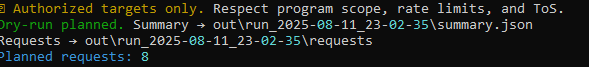
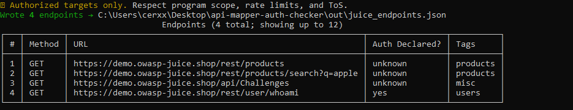
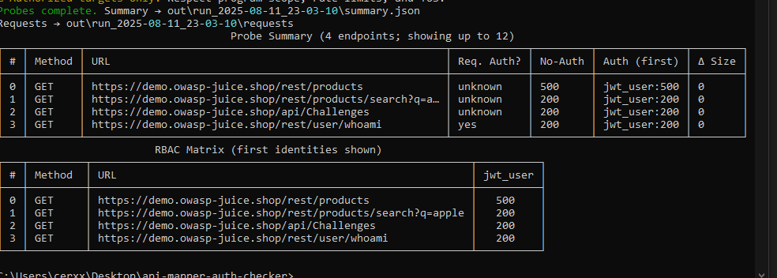

# AMAC — API Mapper + Auth Checker (pentester-friendly)

**AMAC** helps ethical hackers quickly map API endpoints from OpenAPI/Swagger, probe **no-auth vs. authenticated** behavior (including multiple identities), and produce a tidy HTML report — all while respecting strict **scope safety rails**.

> ⚠️ **Authorized targets only.** You are solely responsible for ensuring you have permission. Use conservative scope, budgets, and rates.

---

## TL;DR

```bash
# 1) Install (editable mode)
py -m pip install -U pip
py -m pip install -e .

# 2) Run the local demo
python scripts/mock_api.py          # terminal A
scripts/demo_win.bat                # terminal B (Windows)
# or: pwsh -File scripts/demo_ps.ps1

# 3) Real target (OpenAPI mapping → probe → analyze → report)
amac map    --openapi <spec.json|yaml|URL> --scope examples/scope_advanced.yml --out out/endpoints.json
amac probe  --endpoints out/endpoints.json --scope examples/scope_advanced.yml --auth <your_auth.yml> --identities all
amac analyze --run-dir out/run_YYYY-MM-DD_HH-MM-SS
amac report  --run-dir out/run_YYYY-MM-DD_HH-MM-SS
````

---

## What it does (today)

* **OpenAPI → Endpoints (GET/HEAD):** handles server variables (`servers[].variables`), `$ref` for parameters, required path/query param sampling, inherited security.
* **Scope safety rails:**

  * Host **allow/deny** and **base URLs**
  * **Per-path allow/deny** (glob or `re:` patterns)
  * **Hard request budget** to stop over-scans
* **Probing & RBAC matrix:**

  * Sends **no-auth** + one or **all identities** (RBAC view)
  * Auth types: **Bearer/header**, **Basic**, **Cookie**, **OAuth2 (client-credentials, password)**, **form-login cookie capture**
  * One-shot **refresh** retry for OAuth2/form-login after 401
* **WAF-friendly pacing:** global + per-host concurrency caps, RPS limiter, jitter, bounded backoff, TLS/redirect controls.
* **Evidence hygiene:** header redaction (auth/cookie/api keys), response snippet privacy levels (`none|minimal|strict`).
* **Findings + HTML report:** conservative heuristics flag likely auth/enforcement issues; export JSON/Markdown + HTML.
* **Dry-run mode:** plan requests without sending traffic.
* **Windows-friendly:** mock server + demo scripts; works cross-platform.

---

## “Basic today” features (I'll iterate)

These work in a minimal form now; I plan to expand them:

* **OAuth2:** client-credentials & password only (no **PKCE** yet), no **mTLS**.
* **Methods:** **GET/HEAD only** (no safe POST payload sampler yet).
* **Heuristics:** intentionally **conservative** (favor low false positives).
* **Crawling:** no **auto-pagination** crawler yet.

> Want these sooner? Open an issue or PR — happy to collaborate.

---

## Install

* Python **3.10+** recommended (3.10–3.12 widely used; 3.13 also works).
* Editable install:

```bash
py -m pip install -U pip
py -m pip install -e .
```

Check the CLI:

```bash
amac --help
amac --version
```

---

## Quickstart (demo)

1. Run the mock API:

```bash
python scripts/mock_api.py
```

2. In another terminal:

```bash
scripts/demo_win.bat        # Windows CMD
# or
pwsh -File scripts/demo_ps.ps1
```

Outputs:

* `out/local_endpoints.json`
* `out/run_demo/summary.json` and `requests/*.json`
* `out/run_demo/findings.json` + `findings.md`
* `out/run_demo/report.html` ← open in a browser

---

## Real-world usage

1. Create a **tight** scope file (hosts + path allowlists). See `examples/scope_advanced.yml`.

2. Map endpoints from your OpenAPI:

```bash
amac map --openapi <path-or-URL> --scope examples/scope_advanced.yml --out out/endpoints.json
```

3. Dry-run to see the plan (no traffic):

```bash
amac probe --endpoints out/endpoints.json --scope examples/scope_advanced.yml --auth <auth.yml> --dry-run
```

4. Run for real (first identity or all):

```bash
amac probe --endpoints out/endpoints.json --scope examples/scope_advanced.yml --auth <auth.yml> --identities all
amac analyze --run-dir out/run_YYYY-MM-DD_HH-MM-SS
amac report  --run-dir out/run_YYYY-MM-DD_HH-MM-SS
```

---

## Configs

### `scope.yml` (advanced example)

Disable `safe_methods_only` and list `non_safe_methods` to probe operations like
`POST` or `PUT`.

```yaml
allowed:
  - api.example.com
  - "*.dev.example.com"
denied:
  - "admin.example.com"
base_urls:
  - "https://api.example.com"

path_policy:
  deny_paths:
    - "/admin/*"
    - "re:^/internal/.*"
  allow_paths:
    - "/v1/*"
    - "/status"

request_policy:
  safe_methods_only: true
  non_safe_methods: []  # e.g., [POST, PUT]
  max_rps: 2
  concurrency: 6
  per_host_concurrency: 2
  global_jitter_ms: 80
  backoff_cap_s: 3.5
  allow_redirects: false
  verify_tls: true
  hard_request_budget: 200

timeouts:
  connect: 5
  read: 15

evidence:
  privacy_level: minimal
```

### `auth.yml` (examples)

* **Bearer demo** (for local mock): `examples/auth_demo.yml`
* **OAuth2** (client creds/password): `examples/auth_oauth2.yml`
* **Form-login cookie capture**: `examples/auth_form_login.yml`

Use multiple identities to build an **RBAC matrix**:

```bash
amac probe --identities all ...
```

---

## Commands

* `amac map` — Parse OpenAPI/Swagger → `endpoints.json`.
* `amac check` — Validate `scope.yml`, `auth.yml`, and `endpoints.json`.
* `amac probe` — Send **no-auth** + identities; saves snapshots to `requests/` and `summary.json`.

  * `--dry-run` plans without sending traffic
  * `--identities first|all` toggles RBAC breadth
* `amac analyze` — Turn a run dir into `findings.json` + `findings.md`.
* `amac report` — Generate a standalone HTML report.

---

## Testing & Dev

```bash
py -m pip install -r requirements-dev.txt
pytest -q
ruff check .
black --check .
```

---

## Screnshots





## Safety & Legal

* Use only on **authorized** targets.
* Respect program scope, SLAs, ToS, and local laws.
* Redaction is best-effort; verify outputs before sharing.

---

## License

[MIT](./LICENSE)

---
